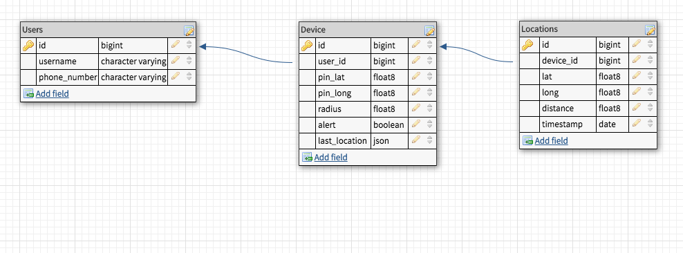

### README

# Machine Ltd
A web based asset tracking application. This is documentation for the Django Back End Api

### See The Active Site:
Production Site:<br>
[No Site Yet](#) <br>

API Base URL:<br>
[Machine Ltd API](https://machine-ltd.herokuapp.com/api/v1)<br>

Pitch:
This is an asset tracking application that allows a user to set a geo-fence by  a center GPS coordinate and a radius. The hardware will then make post requests to the 'api/v1/devices/:device_id/locations' endpoint which will create a new database entry for the devices location. If the location is outside the geo-fence it will send an alert to the user by sms.

Tech Pitch:
This project is designed to be modular, and service oriented. The API itself is built in Python/Django and the front-end will be built in Ruby/Rails for mobile-web, and React for native apps.

### Table Of Contents
- [Basic Repo Info](#basic-repo-info)
- [Database and Schema](#database-and-schema)
- [API End Points](#api-end-points)
- [The Test Suite](#the-test-suite)
- [Authors](#authors)

---

### Basic Repo Info:

#### Versions/Prerequisites

To Install and run this application please be aware of the following versions and requirements:
- PostgreSQL 10+
- Python 3.7
- Django 2.0

---

### Database and Schema

The database is a PostgreSQL database, made up of three tables.

- Users
- Devices
- Locations

The relationships are as follows:

- Many-to-One: Devices to User
- Many-to-One: Locations to Device

<br>


---

### API End Points

---
#### Users
The users table includes full CRUD functionality, however it does not include a full index of users.

##### GET REQUESTS
<br>

A user has the following attributes:
 - username
 - phone_number
 - devices

```
GET /api/v1/users/:user_id
```

The user will be returned in as JSON to look like:

```
{
  "username": "Thrasher",
  "phone_number": "+17195556555",
  "devices": []
}
```

<br>


##### POST REQUESTS

<br>

To create a user send a post request:

```
POST /api/v1/users
```


Set the body of the request to this format:

```
{
  "username": "Thrasher",
  "phone_number": "+17196639883"
}
```

This will return the user info as JSON
<br>


##### PATCH REQUESTS
<br>
NOTE: To update a user, you MUST pass both the username and phone_number as part of the request body.

To update a user:

```
PATCH /api/users/:user_id
```

Set the body:

```
{
  "username": "NewUsername",
  "phone_number": "+1OrNewPhone"
}
```

<br>

##### DELETE REQUESTS

<br>
To delete a food item:

```
DELETE /api/users/:user_id
```

---
#### Devices
The Device Attributes are
- User_id: user that the device belongs to
- radius: geo-fence distance for the device
- pin_lat: geo-fence latitude coordinate
- pin_long: geo-fence longitude coordinate
- alert: boolean to keep track of fence activation

##### GET REQUESTS

<br>

Index:

Again there is no full index for all devices, but there is an index for each user at:

```
GET /api/v1/users/:user_id/devices
```

Single Device Endpoint:

If the device has a last location, the location will also be nested in the response for a single endpoint.

```
GET /api/v1/devices/:device_id
```

The response will look like:
```
{
    "id": 1,
    "pin_lat": 29.9965616,
    "pin_long": -115.2348832,
    "radius": 500.0,
    "alert": True
    "last_location": {
        "id": 539,
        "lat": 29.9965616,
        "long": -115.2348832,
        "distance": 0.0,
        "timestamp": "23:49:28 07-30-2018"
    }
}
```

##### POST REQUESTS

<br>

To create a device send a post request:

```
POST /api/v1/users/:user_id/devices
```


Set the body of the request to this format (at a minimum the API requires the three following attributes, however you can also set the alert and the radius(in meters)):

```
{
  "pin_lat": "39.996292",
  "pin_long": "-105.23503"
}
```

This will return the device info as JSON

<br>

##### PATCH REQUESTS

<br>

To update a device send a patch/put request:

```
PATCH /api/v1/users/devices/:device_id
```


Set the body of the request to this format (at a minimum the API requires the three following attributes, however again you can also reset the alert and the radius(in meters)):

```
{
  "pin_lat": "39.996292",
  "pin_long": "-105.23503"
}
```

This will return the device info as JSON

<br>

##### DELETE REQUESTS

<br>

To delete a device send a delete request:

```
DELETE /api/v1/users/devices/:device_id
```

---
#### Locations
The Location Attributes are
- Device_id: device that the device belongs to
- lat: latitude coordinate
- long: longitude coordinate
- distance: automatically calculated from the devices pin location
- timestamp: date/time the location was added

There are only two endpoints for locations:
- Index by device
- Add location to device

##### GET REQUESTS

<br>

Index:

Again there is no full index for all locations, but there is an index for each device at:

```
GET /api/v1/devices/:device_id/history
```

The response will look like:
```
[
    {
        "id": 541,
        "lat": 39.9965616,
        "long": -105.2348832,
        "distance": 0.0,
        "timestamp": "00:09:12 07-31-2018"
    },
    {
        "id": 540,
        "lat": 39.9965616,
        "long": -105.2348832,
        "distance": 0.0,
        "timestamp": "23:59:18 07-30-2018"
    },
    {
        "id": 539,
        "lat": 39.9965616,
        "long": -105.2348832,
        "distance": 0.0,
        "timestamp": "23:49:28 07-30-2018"
    },
    {
        "id": 538,
        "lat": 39.9965616,
        "long": -105.2348832,
        "distance": 0.0,
        "timestamp": "23:39:42 07-30-2018"
    }
]
```

##### POST REQUESTS

<br>

To create a location send a post request:

```
POST /api/v1/devices/:device_id/locations
```


Set the body of the request to this format (at a minimum the API requires the latitude and longitude:

```
{
  "lat": "39.999291",
  "long": "-105.25802"
}
```

This will return the device info as JSON

<br>

---

### The Test Suite

##### About The Tests:
 The test suite includes test for the following:
- Model Level Testing
- API Request Testing<br>


To run all tests:
```
python3 manage.py test V1/Tests
```

<br>


### Authors
- [Tyler Lundgren](https://github.com/nergdnvlt)
